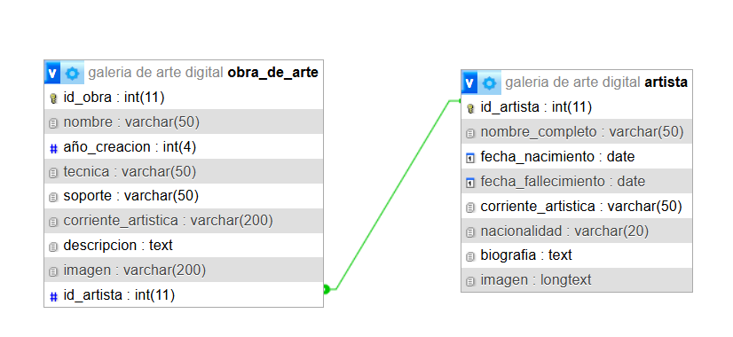

# Galería de Arte Digital

## Integrantes

- Fermin Ares Ricón(faresricon@alumnos.exa.unicen.edu.ar)
- Antonella Pedini(apedini@alumnos.exa.unicen.edu.ar)

## Temática
Galeria de arte digital, obras de arte digitalizadas e información de los artias. 

## Descripción
Este sitio web permite visualizar una amplia colección de arte en formato digitalizado con detalles de información del transfondo de la obra tales como un id, nombre de la obra, año de creación, técnica, soporte(material fisico/base sobre la cual está aplicada o creada la obra), corriente artistica, una imagen de la obra, y una descripción/ análisis de la misma.
Almacena  una lista de artistas historicos y contemporáneos con un id, nombre completo, fecha de nacimiento y fallecimiento, corriente artistica reflejada en sus obras, nacionalidad, una breve biografia, y una imagen del artista.
Cada una de las obras de arte está vinculada con su artista correspondiente.

## Diagrama de entidades-relación (DER)

