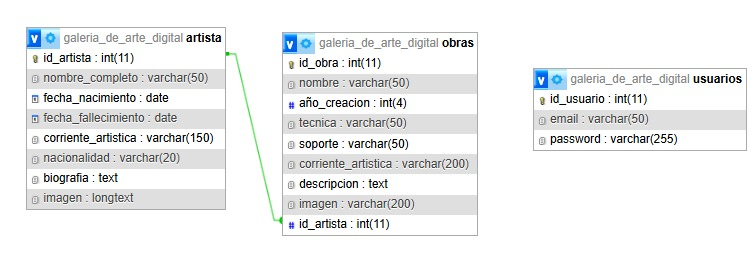

# Galería de Arte Digital

## Integrantes

- Fermin Ares Ricón(faresricon@alumnos.exa.unicen.edu.ar)
- Antonella Pedini(apedini@alumnos.exa.unicen.edu.ar)

## Temática
Galeria de arte digital, obras de arte digitalizadas e información de los artistas.

## Descripción
Este sitio web permite visualizar una amplia colección de arte en formato digitalizado con detalles de información del transfondo de la obra tales como un id, nombre de la obra, año de creación, técnica, soporte(material fisico/base sobre la cual está aplicada o creada la obra), corriente artistica, una imagen de la obra, y una descripción/ análisis de la misma.
Almacena  una lista de artistas historicos y contemporáneos con un id, nombre completo, fecha de nacimiento y fallecimiento, corriente artistica reflejada en sus obras, nacionalidad, una breve biografia, y una imagen del artista.
Cada una de las obras de arte está vinculada con su artista correspondiente.
Además, el sitio cuenta con la posibilidad de acceder mediante una cuenta de administrador para hacer uso de funciones relacionadas a ABM.

## Diagrama de entidades-relación (DER)

## Funcionalidades
### Acceso público
El sitio permite la visualización de obras de arte con detalles de cada una, incluyendo los artistas que las crearon, como así también la visualización de los respectivos artistas con información personal y artística.

### Acceso administrador
Se provee la funcionalidad de ingresar a una cuenta administradora de la galería, la cual da acceso a funciones ABM (agregación, eliminación y edición) tanto de las entidades obras, como de artistas.

## Cómo desplegar el sitio
### Requisitos
- Apache y MySql (en este caso se hizo uso de XAMPP)

### Cómo hacerlo
1. Clona o descargar el proyecto en tu servidor web (ej: htdocs en XAMPP).
2. En XAMPP, presioná "Start" en Apache y MySql
3. Accedé a 'http://localhost/TP1-Web-2' (por defecto). La base de datos se creará de manera automática en el primer acceso, como así también la inserción de los registros asociados a cada tabla.

### Usuario administrador
- Usuario: webadmin@admin.com
- Contraseña: admin

